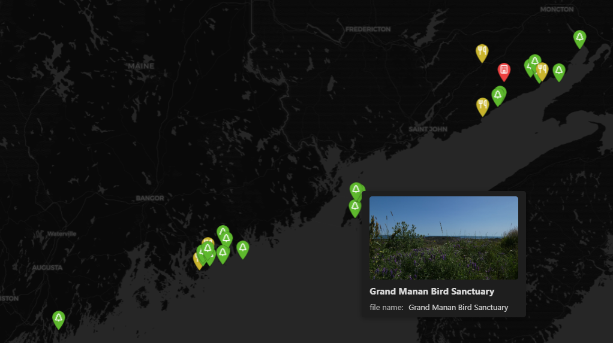
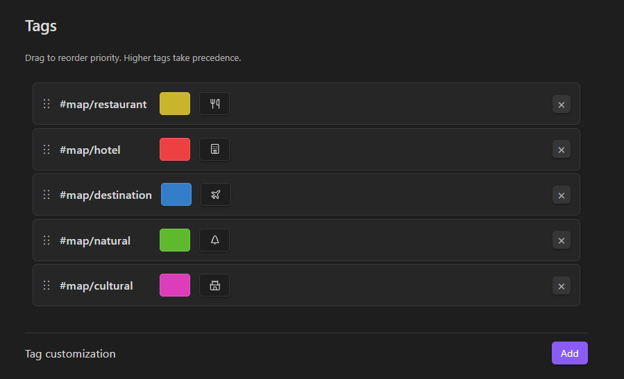

# Map+

A performant and customizable map layout for Obsidian Bases. This plugin functions similarly to [the official Maps plugin](https://github.com/obsidianmd/obsidian-maps), but is more performant for big vaults, adds extensibility with a tag hierarchy, adds thumbnail support to locations, and allows more customizability in general.

## Usage

### Setting up coordinates

**Option 1: Use global frontmatter keys**

In plugin settings, set:
- Latitude key (e.g., `lat` or `location[0]`)
- Longitude key (e.g., `lng` or `location[1]`)

These will be used as the global default.

**Option 2: Use a coordinates property in your base**

In your base view options, set the "Coordinates property" to a property containing coordinates.

The property value should be either:
- A list: `[latitude, longitude]`
- A string: `"latitude,longitude"`

### Customizing tags

In plugin settings under "Tags":

1. Click "Add" to create a tag customization
2. Choose a tag from your vault
3. Pick a color and optional icon
4. Drag tags to reorder priority

Higher tags take precedence in locations with multiple tags.
